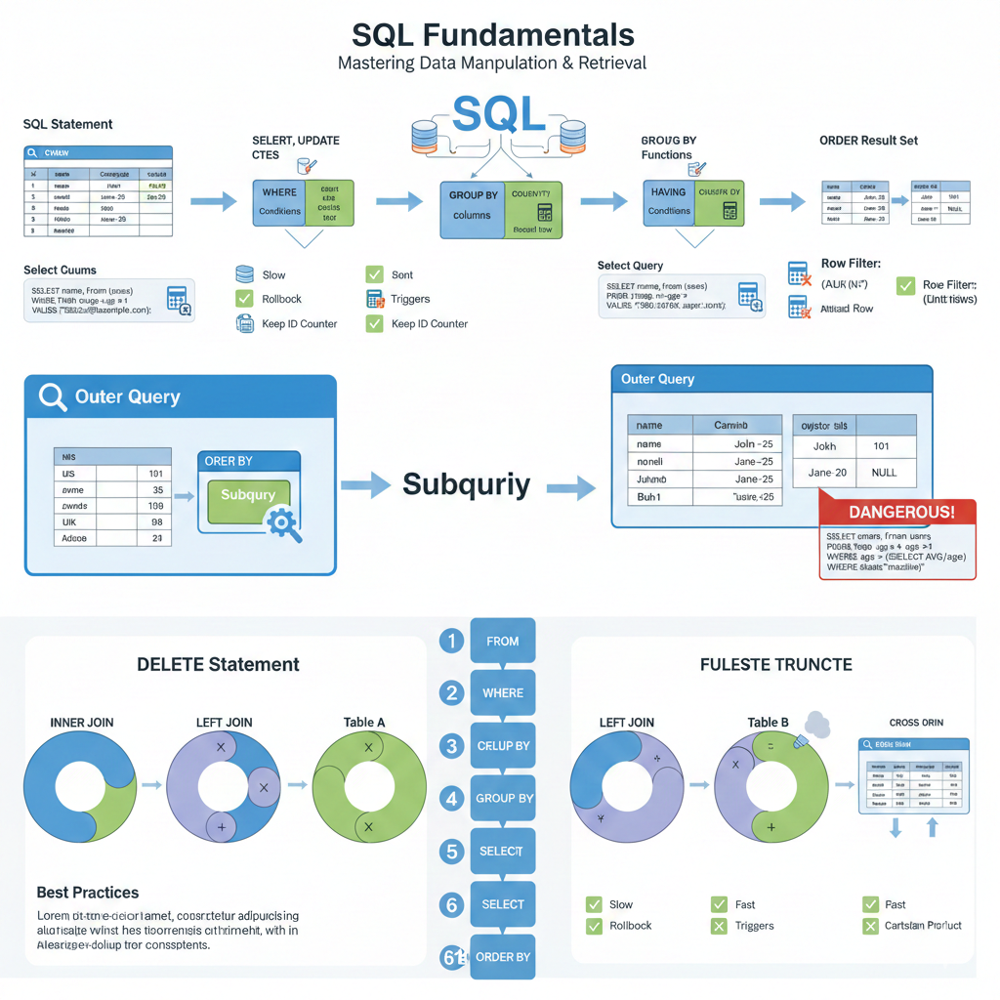

# SQL Fundamentals

## 💡 **Overview**

SQL (Structured Query Language) is the universal language for communicating with relational databases.

**What You'll Learn:**
- Core SQL commands for data manipulation (SELECT, INSERT, UPDATE, DELETE)
- Advanced querying techniques (JOINs, subqueries, CTEs)
- Aggregate functions and data grouping
- Window functions for analytics
- Interview-ready patterns and best practices

**Why This Matters:**
- SQL is used by 90%+ of modern applications
- Database operations are among the most common backend tasks
- SQL knowledge is tested in virtually every backend interview
- Mastering SQL fundamentals enables efficient data manipulation and retrieval



*Figure: Visual overview of SQL fundamentals - covering statements, queries, JOINs, subqueries, and execution order*

## Basic SQL Commands

### 💡 **SELECT Statement**

The SELECT statement retrieves data from database tables.

**How It Works:**

SELECT specifies which columns to retrieve, FROM specifies the table, and optional clauses filter, sort, and limit results.

**Common Patterns:**

| Pattern | Use Case | Example |
|---------|----------|---------|
| `SELECT *` | Get all columns (avoid in production) | `SELECT * FROM users` |
| `SELECT col1, col2` | Get specific columns (recommended) | `SELECT name, email FROM users` |
| `SELECT DISTINCT` | Get unique values only | `SELECT DISTINCT country FROM users` |
| `SELECT ... AS` | Rename columns in output | `SELECT name AS full_name FROM users` |

**Basic Syntax Examples:**

```sql
-- ✅ Select specific columns (best practice)
SELECT name, email FROM users;

-- ⚠️ Select all columns (avoid in production - impacts performance)
SELECT * FROM users;

-- Rename columns with aliases
SELECT name AS full_name, email AS email_address FROM users;

-- Get unique values only
SELECT DISTINCT country FROM users;

-- Limit results (pagination - first page)
SELECT * FROM users LIMIT 10;

-- Pagination with offset (page 3)
SELECT * FROM users LIMIT 10 OFFSET 20;
```

**Pagination Pattern:**

```sql
-- Page 1: LIMIT 10 OFFSET 0  (skip 0, take 10)
-- Page 2: LIMIT 10 OFFSET 10 (skip 10, take 10)
-- Page 3: LIMIT 10 OFFSET 20 (skip 20, take 10)
```

> **Key Insight:** Always use `SELECT column1, column2` instead of `SELECT *` in production. Selecting specific columns improves performance and reduces network overhead.

### 💡 **WHERE Clause**

Filter rows based on specified conditions.

**How It Works:**

WHERE clause evaluates each row against the condition. Only rows where the condition is TRUE are returned.

**Comparison Operators:**

| Operator | Meaning | Example |
|----------|---------|---------|
| `=` | Equal to | `WHERE age = 25` |
| `!=` or `<>` | Not equal to | `WHERE age != 25` |
| `>` | Greater than | `WHERE age > 18` |
| `>=` | Greater than or equal | `WHERE age >= 18` |
| `<` | Less than | `WHERE age < 65` |
| `<=` | Less than or equal | `WHERE age <= 65` |

**Logical Operators:**

| Operator | Purpose | Example |
|----------|---------|---------|
| `AND` | All conditions must be true | `WHERE age > 18 AND country = 'USA'` |
| `OR` | At least one condition must be true | `WHERE age < 18 OR age > 65` |
| `NOT` | Negates a condition | `WHERE NOT country = 'USA'` |

**Examples:**

```sql
-- Equality check
SELECT * FROM users WHERE age = 25;

-- Comparison operators
SELECT * FROM users WHERE age > 18;
SELECT * FROM users WHERE age >= 18;
SELECT * FROM users WHERE age < 65;
SELECT * FROM users WHERE age != 25;  -- or age <> 25

-- ✅ AND: Both conditions must be true
SELECT * FROM users WHERE age > 18 AND country = 'USA';

-- ✅ OR: At least one condition must be true
SELECT * FROM users WHERE age < 18 OR age > 65;

-- NOT operator (negation)
SELECT * FROM users WHERE NOT country = 'USA';

-- IN operator (matches any value in list)
SELECT * FROM users WHERE country IN ('USA', 'Canada', 'UK');

-- BETWEEN operator (inclusive range)
SELECT * FROM users WHERE age BETWEEN 18 AND 65;  -- 18 <= age <= 65

-- LIKE operator (pattern matching)
SELECT * FROM users WHERE name LIKE 'John%';   -- Starts with John
SELECT * FROM users WHERE name LIKE '%Doe';    -- Ends with Doe
SELECT * FROM users WHERE name LIKE '%son%';   -- Contains 'son'
SELECT * FROM users WHERE name LIKE 'J_hn';    -- _ matches single character

-- NULL handling
SELECT * FROM users WHERE phone IS NULL;       -- Has no phone
SELECT * FROM users WHERE phone IS NOT NULL;   -- Has a phone
```

**LIKE Pattern Matching:**

| Pattern | Matches | Example |
|---------|---------|---------|
| `'John%'` | Starts with "John" | John, Johnny, Johnson |
| `'%Doe'` | Ends with "Doe" | Doe, Jane Doe |
| `'%son%'` | Contains "son" | Johnson, Mason, Samson |
| `'J_hn'` | J, any char, hn | John, Jahn |

> **Key Insight:** Always use `IS NULL` / `IS NOT NULL` to check for NULL values. Using `= NULL` or `!= NULL` won't work because NULL represents unknown, and comparisons with NULL always return NULL (not TRUE or FALSE).

### 💡 **ORDER BY**

Sort query results by one or more columns.

**How It Works:**

ORDER BY sorts the result set based on specified columns. Default is ascending (ASC), but you can specify descending (DESC).

**Sort Order:**

| Order | Keyword | Example |
|-------|---------|---------|
| **Ascending** | `ASC` (default) | `ORDER BY name` or `ORDER BY name ASC` |
| **Descending** | `DESC` | `ORDER BY age DESC` |

**Examples:**

```sql
-- Ascending order (default)
SELECT * FROM users ORDER BY name;
SELECT * FROM users ORDER BY name ASC;  -- Same as above

-- Descending order
SELECT * FROM users ORDER BY age DESC;

-- Multiple columns (sorts by country first, then name within each country)
SELECT * FROM users ORDER BY country, name;

-- Mixed sorting (country ascending, age descending)
SELECT * FROM users ORDER BY country ASC, age DESC;

-- Sorting by column position (not recommended, less readable)
SELECT name, email, age FROM users ORDER BY 3 DESC;  -- Sorts by 3rd column (age)

-- Sorting with NULL values
SELECT * FROM users ORDER BY phone NULLS FIRST;   -- NULLs appear first
SELECT * FROM users ORDER BY phone NULLS LAST;    -- NULLs appear last (default)
```

**Common Patterns:**

```sql
-- Most recent first (common for timestamps)
SELECT * FROM posts ORDER BY created_at DESC;

-- Alphabetical listing
SELECT * FROM products ORDER BY name ASC;

-- Priority sorting (status, then date)
SELECT * FROM orders
ORDER BY
  CASE status
    WHEN 'urgent' THEN 1
    WHEN 'pending' THEN 2
    ELSE 3
  END,
  created_at DESC;
```

> **Key Insight:** When sorting by multiple columns, SQL sorts by the first column, then breaks ties using the second column, and so on.

### 💡 **INSERT Statement**

Add new rows to a table.

**How It Works:**

INSERT adds new records to a table. You specify the table name, columns, and values to insert.

**Syntax Patterns:**

| Pattern | Use Case | Performance |
|---------|----------|-------------|
| Single row | Insert one record | Fast |
| Multiple rows | Insert many records at once | Faster than multiple single inserts |
| INSERT from SELECT | Copy data from another table/query | Fastest for bulk data |

**Examples:**

```sql
-- Single row insert
INSERT INTO users (name, email, age)
VALUES ('John Doe', 'john@example.com', 30);

-- Multiple rows (batch insert - more efficient)
INSERT INTO users (name, email, age) VALUES
  ('John Doe', 'john@example.com', 30),
  ('Jane Smith', 'jane@example.com', 25),
  ('Bob Johnson', 'bob@example.com', 35);

-- Insert with default values
INSERT INTO users (name, email)  -- age will use default value
VALUES ('John Doe', 'john@example.com');

-- Insert all columns (not recommended - order dependent)
INSERT INTO users VALUES (1, 'John', 'john@example.com', 30);

-- Insert from SELECT (copy data)
INSERT INTO archived_users
SELECT * FROM users WHERE last_login < '2023-01-01';

-- Insert with RETURNING (PostgreSQL - get inserted data)
INSERT INTO users (name, email, age)
VALUES ('John Doe', 'john@example.com', 30)
RETURNING id, name, created_at;

-- Insert or ignore duplicates (MySQL)
INSERT IGNORE INTO users (email, name)
VALUES ('john@example.com', 'John Doe');

-- Insert or update on conflict (PostgreSQL)
INSERT INTO users (email, name, age)
VALUES ('john@example.com', 'John Doe', 30)
ON CONFLICT (email)
DO UPDATE SET name = EXCLUDED.name, age = EXCLUDED.age;
```

**Best Practices:**

- ✅ Always specify column names (not `INSERT INTO users VALUES (...)`)
- ✅ Use batch inserts for multiple rows (faster than individual inserts)
- ✅ Use transactions for large batch inserts
- ❌ Don't insert into auto-increment columns manually

> **Key Insight:** Batch inserts (multiple VALUES) are much faster than individual INSERT statements because they reduce network round-trips and transaction overhead.

### 💡 **UPDATE Statement**

Modify existing rows in a table.

**How It Works:**

UPDATE changes values in existing rows. You specify which columns to update and which rows to affect with a WHERE clause.

**⚠️ Critical Warning:**

```sql
-- ❌ DANGEROUS: Updates ALL rows (no WHERE clause)
UPDATE users SET status = 'inactive';  -- Updates EVERY user!

-- ✅ SAFE: Updates specific rows
UPDATE users SET status = 'inactive' WHERE id = 1;
```

**Examples:**

```sql
-- Update single column
UPDATE users SET email = 'newemail@example.com' WHERE id = 1;

-- Update multiple columns
UPDATE users
SET email = 'newemail@example.com', age = 31
WHERE id = 1;

-- Update with calculation (10% price increase)
UPDATE products SET price = price * 1.1 WHERE category = 'electronics';

-- Update with CASE statement (conditional update)
UPDATE users
SET status = CASE
  WHEN last_login > NOW() - INTERVAL '30 days' THEN 'active'
  WHEN last_login > NOW() - INTERVAL '90 days' THEN 'inactive'
  ELSE 'dormant'
END;

-- Update from another table (MySQL)
UPDATE orders o
INNER JOIN users u ON o.user_id = u.id
SET o.discount = 0.1
WHERE u.status = 'premium';

-- Update from another table (PostgreSQL)
UPDATE orders o
SET discount = 0.1
FROM users u
WHERE o.user_id = u.id AND u.status = 'premium';

-- Update with subquery
UPDATE users
SET total_orders = (
  SELECT COUNT(*) FROM orders WHERE user_id = users.id
)
WHERE id = 1;

-- Increment/Decrement
UPDATE products SET stock = stock - 5 WHERE id = 1;  -- Decrease stock
UPDATE users SET login_count = login_count + 1 WHERE id = 1;  -- Increment

-- Update with RETURNING (PostgreSQL - see updated values)
UPDATE users SET status = 'active' WHERE id = 1
RETURNING id, status, updated_at;
```

**Common Patterns:**

```sql
-- Deactivate old records
UPDATE users
SET status = 'inactive'
WHERE last_login < NOW() - INTERVAL '1 year';

-- Apply bulk discount
UPDATE products
SET price = price * 0.9
WHERE category = 'clearance';

-- Update timestamp
UPDATE posts
SET updated_at = NOW()
WHERE id = 1;
```

> **Key Insight:** ALWAYS use a WHERE clause with UPDATE unless you genuinely want to update every single row in the table. Missing WHERE is one of the most common and dangerous SQL mistakes!

### 💡 **DELETE Statement**

Remove rows from a table.

**How It Works:**

DELETE removes rows that match the WHERE condition. Without WHERE, it deletes ALL rows.

**⚠️ Critical Warning:**

```sql
-- ❌ DANGEROUS: Deletes ALL rows (no WHERE clause)
DELETE FROM users;  -- Deletes EVERY user!

-- ✅ SAFE: Deletes specific rows
DELETE FROM users WHERE id = 1;
```

**DELETE vs TRUNCATE:**

| Feature | DELETE | TRUNCATE |
|---------|--------|----------|
| **WHERE Clause** | ✅ Supported | ❌ Not supported |
| **Speed** | Slower (row-by-row) | Faster (drops table) |
| **Rollback** | ✅ Can rollback | ❌ Can't rollback (DDL) |
| **Triggers** | ✅ Fires triggers | ❌ Doesn't fire triggers |
| **Auto-increment** | Keeps value | Resets to 1 |
| **Identity** | Logs each deletion | Minimal logging |

**Examples:**

```sql
-- Delete specific rows
DELETE FROM users WHERE id = 1;

-- Delete with condition
DELETE FROM users WHERE last_login < '2022-01-01';

-- Delete with subquery
DELETE FROM users
WHERE id IN (SELECT user_id FROM banned_users);

-- Delete with JOIN (MySQL)
DELETE users
FROM users
INNER JOIN orders ON users.id = orders.user_id
WHERE orders.status = 'fraud';

-- Delete with JOIN (PostgreSQL)
DELETE FROM users
USING orders
WHERE users.id = orders.user_id AND orders.status = 'fraud';

-- Delete all rows (dangerous - use with caution!)
DELETE FROM users;

-- TRUNCATE (faster, resets auto-increment)
TRUNCATE TABLE users;  -- Deletes all rows, resets ID counter

-- TRUNCATE with CASCADE (PostgreSQL - also truncate dependent tables)
TRUNCATE TABLE users CASCADE;

-- Delete with RETURNING (PostgreSQL - see deleted data)
DELETE FROM users WHERE id = 1
RETURNING id, name, email;

-- Delete with LIMIT (MySQL - delete only N rows)
DELETE FROM logs WHERE created_at < '2023-01-01' LIMIT 1000;
```

**Common Patterns:**

```sql
-- Clean up old logs
DELETE FROM logs WHERE created_at < NOW() - INTERVAL '90 days';

-- Remove inactive users
DELETE FROM users WHERE status = 'inactive' AND last_login < NOW() - INTERVAL '2 years';

-- Delete orphaned records
DELETE FROM order_items
WHERE order_id NOT IN (SELECT id FROM orders);
```

**Soft Delete Alternative:**

```sql
-- Instead of DELETE, mark as deleted (preserves data)
ALTER TABLE users ADD COLUMN deleted_at TIMESTAMP NULL;

-- "Delete" user (soft delete)
UPDATE users SET deleted_at = NOW() WHERE id = 1;

-- Query active users only
SELECT * FROM users WHERE deleted_at IS NULL;

-- Restore deleted user
UPDATE users SET deleted_at = NULL WHERE id = 1;
```

> **Key Insight:** Use DELETE for selective removal with WHERE clause. Use TRUNCATE when you need to remove ALL rows quickly. Consider soft deletes (UPDATE with deleted_at) when you need to preserve data for audit or recovery purposes.

## 💡 **Aggregate Functions**

Perform calculations on sets of rows and return a single result.

**How It Works:**

Aggregate functions process multiple rows and return a single summary value. They're typically used with GROUP BY to summarize data by category.

**Common Aggregate Functions:**

| Function | Purpose | Example Result | NULL Handling |
|----------|---------|----------------|---------------|
| `COUNT(*)` | Count all rows | `1000` | Counts NULL rows |
| `COUNT(column)` | Count non-NULL values | `950` | Ignores NULLs |
| `SUM(column)` | Sum numeric values | `50000` | Ignores NULLs |
| `AVG(column)` | Average of values | `28.5` | Ignores NULLs |
| `MIN(column)` | Minimum value | `18` | Ignores NULLs |
| `MAX(column)` | Maximum value | `65` | Ignores NULLs |

**Examples:**

```sql
-- COUNT: Count rows
SELECT COUNT(*) FROM users;  -- All rows including NULLs
SELECT COUNT(phone) FROM users;  -- Only rows with non-NULL phone
SELECT COUNT(DISTINCT country) FROM users;  -- Unique countries

-- SUM: Total of numeric column
SELECT SUM(price) FROM orders;
SELECT SUM(quantity * price) FROM order_items;  -- Calculated sum

-- AVG: Average value
SELECT AVG(age) FROM users;
SELECT AVG(price) FROM products WHERE category = 'electronics';

-- MIN/MAX: Smallest and largest values
SELECT MIN(age), MAX(age) FROM users;
SELECT MIN(price) as cheapest, MAX(price) as most_expensive FROM products;

-- Multiple aggregates in one query
SELECT
  COUNT(*) as total_users,
  COUNT(phone) as users_with_phone,
  AVG(age) as average_age,
  MIN(age) as youngest,
  MAX(age) as oldest,
  SUM(CASE WHEN status = 'active' THEN 1 ELSE 0 END) as active_count
FROM users;

-- Aggregate with filtering
SELECT COUNT(*) as adult_count
FROM users
WHERE age >= 18;

-- DISTINCT with aggregates
SELECT COUNT(DISTINCT country) as countries_represented FROM users;
SELECT AVG(DISTINCT age) as distinct_avg_age FROM users;
```

**Common Patterns:**

```sql
-- Total revenue
SELECT SUM(total) as total_revenue FROM orders;

-- Average order value
SELECT AVG(total) as avg_order_value FROM orders;

-- Count by status
SELECT status, COUNT(*) as count
FROM users
GROUP BY status;

-- Statistics summary
SELECT
  COUNT(*) as total,
  MIN(created_at) as first_signup,
  MAX(created_at) as last_signup,
  AVG(age) as avg_age
FROM users;

-- Percentage calculation
SELECT
  COUNT(*) as total_users,
  COUNT(CASE WHEN status = 'active' THEN 1 END) as active_users,
  ROUND(100.0 * COUNT(CASE WHEN status = 'active' THEN 1 END) / COUNT(*), 2) as active_percentage
FROM users;
```

> **Key Insight:** Aggregate functions ignore NULL values (except COUNT(*)). Use COUNT(*) to count all rows including NULLs, or COUNT(column) to count only non-NULL values.

## 💡 **GROUP BY**

Group rows that have the same values in specified columns and apply aggregate functions.

**How It Works:**

GROUP BY divides rows into groups based on column values, then applies aggregate functions to each group separately.

**Execution Order:**

```
1. FROM - Get data from table
2. WHERE - Filter individual rows
3. GROUP BY - Group rows
4. HAVING - Filter groups
5. SELECT - Select columns and aggregates
6. ORDER BY - Sort results
```

**WHERE vs HAVING:**

| Clause | Filters | When Applied | Works With |
|--------|---------|--------------|------------|
| **WHERE** | Individual rows | Before grouping | Column values |
| **HAVING** | Groups | After grouping | Aggregate results |

**Examples:**

```sql
-- Group by single column
SELECT country, COUNT(*) as user_count
FROM users
GROUP BY country;

-- Group by multiple columns (combinations)
SELECT country, city, COUNT(*) as user_count
FROM users
GROUP BY country, city;

-- Group with aggregate
SELECT country, AVG(age) as avg_age, COUNT(*) as count
FROM users
GROUP BY country;

-- Multiple aggregates per group
SELECT
  country,
  COUNT(*) as total_users,
  COUNT(CASE WHEN status = 'active' THEN 1 END) as active_users,
  AVG(age) as avg_age,
  MIN(age) as youngest,
  MAX(age) as oldest
FROM users
GROUP BY country;

-- HAVING clause (filter groups)
SELECT country, COUNT(*) as user_count
FROM users
GROUP BY country
HAVING COUNT(*) > 100;

-- WHERE + GROUP BY + HAVING
SELECT country, AVG(age) as avg_age
FROM users
WHERE status = 'active'  -- Filter rows before grouping
GROUP BY country
HAVING AVG(age) > 30;  -- Filter groups after aggregation

-- GROUP BY with ORDER BY
SELECT country, COUNT(*) as user_count
FROM users
GROUP BY country
ORDER BY user_count DESC;

-- GROUP BY with calculated column
SELECT
  YEAR(created_at) as signup_year,
  COUNT(*) as user_count
FROM users
GROUP BY YEAR(created_at)
ORDER BY signup_year DESC;

-- GROUP BY with CASE (conditional grouping)
SELECT
  CASE
    WHEN age < 18 THEN 'Minor'
    WHEN age BETWEEN 18 AND 64 THEN 'Adult'
    ELSE 'Senior'
  END as age_group,
  COUNT(*) as count
FROM users
GROUP BY
  CASE
    WHEN age < 18 THEN 'Minor'
    WHEN age BETWEEN 18 AND 64 THEN 'Adult'
    ELSE 'Senior'
  END;
```

**Common Patterns:**

```sql
-- Revenue by month
SELECT
  DATE_FORMAT(order_date, '%Y-%m') as month,
  SUM(total) as monthly_revenue,
  COUNT(*) as order_count
FROM orders
GROUP BY DATE_FORMAT(order_date, '%Y-%m')
ORDER BY month DESC;

-- Top categories by sales
SELECT category, SUM(quantity) as total_sold
FROM products
JOIN order_items ON products.id = order_items.product_id
GROUP BY category
ORDER BY total_sold DESC
LIMIT 10;

-- Users by status
SELECT status, COUNT(*) as count
FROM users
GROUP BY status;

-- Average order value by customer
SELECT
  user_id,
  COUNT(*) as order_count,
  AVG(total) as avg_order_value,
  SUM(total) as lifetime_value
FROM orders
GROUP BY user_id
HAVING COUNT(*) > 5  -- Customers with more than 5 orders
ORDER BY lifetime_value DESC;
```

**GROUP BY All Non-Aggregated Columns:**

```sql
-- ✅ Correct: All non-aggregated columns in GROUP BY
SELECT country, city, COUNT(*) as count
FROM users
GROUP BY country, city;

-- ❌ Error: city not in GROUP BY
SELECT country, city, COUNT(*) as count
FROM users
GROUP BY country;  -- Error: city must be in GROUP BY
```

> **Key Insight:** When using GROUP BY, every column in SELECT that isn't inside an aggregate function must appear in the GROUP BY clause. Use WHERE to filter rows before grouping, and HAVING to filter groups after aggregation.

## 💡 **JOINs**

JOINs combine rows from two or more tables based on a related column.

**How It Works:**

JOIN operations match rows from different tables using a join condition (usually foreign key relationships). Different JOIN types determine which rows are included in the result.

**JOIN Types Decision Table:**

| JOIN Type | Returns | Use When | NULL Handling |
|-----------|---------|----------|---------------|
| **INNER JOIN** | Only matching rows | You need related data from both tables | Excludes unmatched |
| **LEFT JOIN** | All from left + matches from right | You need all records from primary table | NULL for unmatched |
| **RIGHT JOIN** | All from right + matches from left | You need all records from secondary table | NULL for unmatched |
| **FULL OUTER JOIN** | All rows from both tables | You need everything from both sides | NULL for unmatched |
| **CROSS JOIN** | All combinations (Cartesian product) | You need every combination | N/A |

**Visual Representation:**

```
Table A (users)          Table B (orders)
┌──────┬────────┐       ┌──────┬─────────┐
│ id   │ name   │       │ id   │ user_id │
├──────┼────────┤       ├──────┼─────────┤
│  1   │ John   │       │ 101  │   1     │
│  2   │ Jane   │       │ 102  │   1     │
│  3   │ Bob    │       │ 103  │   2     │
└──────┴────────┘       └──────┴─────────┘

INNER JOIN: 3 rows (John-2, Jane-1)
LEFT JOIN:  3 rows (John-2, Jane-1, Bob-0)
```

### INNER JOIN

```sql
-- Returns matching rows from both tables
SELECT users.name, orders.order_date, orders.total
FROM users
INNER JOIN orders ON users.id = orders.user_id;

-- Multiple joins
SELECT u.name, o.order_date, p.product_name, oi.quantity
FROM users u
INNER JOIN orders o ON u.id = o.user_id
INNER JOIN order_items oi ON o.id = oi.order_id
INNER JOIN products p ON oi.product_id = p.id;
```

### LEFT JOIN (LEFT OUTER JOIN)

```sql
-- Returns all rows from left table, matching rows from right table
SELECT u.name, o.order_date
FROM users u
LEFT JOIN orders o ON u.id = o.user_id;

-- Users without orders
SELECT u.name
FROM users u
LEFT JOIN orders o ON u.id = o.user_id
WHERE o.id IS NULL;
```

### RIGHT JOIN (RIGHT OUTER JOIN)

```sql
-- Returns all rows from right table, matching rows from left table
SELECT u.name, o.order_date
FROM users u
RIGHT JOIN orders o ON u.id = o.user_id;
```

### FULL OUTER JOIN

```sql
-- Returns all rows when there's a match in either table
SELECT u.name, o.order_date
FROM users u
FULL OUTER JOIN orders o ON u.id = o.user_id;
```

### CROSS JOIN

```sql
-- Cartesian product (all combinations)
SELECT u.name, p.product_name
FROM users u
CROSS JOIN products p;
```

### SELF JOIN

```sql
-- Join table to itself
SELECT e1.name as employee, e2.name as manager
FROM employees e1
LEFT JOIN employees e2 ON e1.manager_id = e2.id;
```

## 💡 **Subqueries**

A query nested inside another query.

**How It Works:**

Subqueries execute first and return results that the outer query uses. They can appear in SELECT, FROM, WHERE, or HAVING clauses.

**Types of Subqueries:**

| Type | Location | Returns | Use Case |
|------|----------|---------|----------|
| **Scalar** | SELECT, WHERE | Single value | Get a specific value |
| **Column** | WHERE | Single column | List of values for IN |
| **Table** | FROM | Multiple rows/columns | Temporary result set |
| **Correlated** | WHERE, SELECT | Depends on outer query | Row-by-row comparison |

**Examples:**

```sql
-- Subquery in WHERE (find users with high-value orders)
SELECT name FROM users
WHERE id IN (SELECT user_id FROM orders WHERE total > 1000);

-- Subquery with comparison operator
SELECT name FROM users
WHERE age > (SELECT AVG(age) FROM users);

-- Subquery in SELECT (scalar subquery)
SELECT
  name,
  (SELECT COUNT(*) FROM orders WHERE user_id = users.id) as order_count,
  (SELECT SUM(total) FROM orders WHERE user_id = users.id) as total_spent
FROM users;

-- Subquery in FROM (derived table)
SELECT avg_order
FROM (
  SELECT AVG(total) as avg_order
  FROM orders
  GROUP BY user_id
) as user_averages;

-- Correlated subquery (references outer query)
SELECT name
FROM users u
WHERE EXISTS (
  SELECT 1 FROM orders o
  WHERE o.user_id = u.id AND o.total > 1000
);

-- NOT EXISTS (users without orders)
SELECT name
FROM users u
WHERE NOT EXISTS (
  SELECT 1 FROM orders o WHERE o.user_id = u.id
);

-- Subquery with ANY
SELECT name FROM products
WHERE price > ANY (SELECT price FROM products WHERE category = 'budget');

-- Subquery with ALL
SELECT name FROM products
WHERE price > ALL (SELECT price FROM products WHERE category = 'budget');
```

**Common Patterns:**

```sql
-- Find users above average
SELECT name, age
FROM users
WHERE age > (SELECT AVG(age) FROM users);

-- Top N per category
SELECT *
FROM products p1
WHERE price >= (
  SELECT MAX(price)
  FROM products p2
  WHERE p2.category = p1.category
);

-- Find customers with no recent orders
SELECT name
FROM users u
WHERE NOT EXISTS (
  SELECT 1
  FROM orders o
  WHERE o.user_id = u.id AND o.created_at > NOW() - INTERVAL '1 year'
);
```

**EXISTS vs IN:**

```sql
-- EXISTS: Better for large subquery results (stops at first match)
SELECT name FROM users u
WHERE EXISTS (SELECT 1 FROM orders WHERE user_id = u.id);

-- IN: Better for small, static lists
SELECT name FROM users
WHERE country IN ('USA', 'Canada', 'UK');
```

> **Key Insight:** Use EXISTS instead of IN when checking for existence in large tables - EXISTS stops at the first match, making it more efficient. Correlated subqueries run once per outer row, so they can be slow for large datasets.

## 💡 **Common Table Expressions (CTEs)**

Named temporary result sets that exist only during query execution.

**How It Works:**

CTEs use the WITH clause to create named subqueries that can be referenced multiple times in the main query. They improve readability and allow for recursive queries.

**CTE vs Subquery:**

| Feature | CTE | Subquery |
|---------|-----|----------|
| **Readability** | Excellent (named, at top) | Can be hard to read when nested |
| **Reusability** | Can reference multiple times | Must repeat subquery |
| **Recursive** | ✅ Supports recursion | ❌ No recursion |
| **Performance** | Similar (depends on optimizer) | Similar |

**Examples:**

```sql
-- Simple CTE (cleaner than subquery)
WITH high_value_customers AS (
  SELECT user_id, SUM(total) as total_spent
  FROM orders
  GROUP BY user_id
  HAVING SUM(total) > 10000
)
SELECT u.name, u.email, hvc.total_spent
FROM users u
JOIN high_value_customers hvc ON u.id = hvc.user_id
ORDER BY hvc.total_spent DESC;

-- Multiple CTEs (comma-separated)
WITH
  active_users AS (
    SELECT id, name FROM users WHERE status = 'active'
  ),
  recent_orders AS (
    SELECT user_id, COUNT(*) as order_count
    FROM orders
    WHERE created_at > NOW() - INTERVAL '30 days'
    GROUP BY user_id
  )
SELECT au.name, COALESCE(ro.order_count, 0) as recent_orders
FROM active_users au
LEFT JOIN recent_orders ro ON au.id = ro.user_id;

-- CTE referencing another CTE
WITH
  monthly_sales AS (
    SELECT
      DATE_TRUNC('month', order_date) as month,
      SUM(total) as revenue
    FROM orders
    GROUP BY DATE_TRUNC('month', order_date)
  ),
  sales_with_growth AS (
    SELECT
      month,
      revenue,
      LAG(revenue) OVER (ORDER BY month) as prev_month_revenue
    FROM monthly_sales
  )
SELECT
  month,
  revenue,
  prev_month_revenue,
  ROUND(((revenue - prev_month_revenue) / prev_month_revenue) * 100, 2) as growth_pct
FROM sales_with_growth
WHERE prev_month_revenue IS NOT NULL;

-- Recursive CTE (organizational hierarchy)
WITH RECURSIVE employee_hierarchy AS (
  -- Base case: top-level managers (no manager)
  SELECT id, name, manager_id, 0 as level, name as path
  FROM employees
  WHERE manager_id IS NULL

  UNION ALL

  -- Recursive case: employees reporting to each manager
  SELECT e.id, e.name, e.manager_id, eh.level + 1, eh.path || ' > ' || e.name
  FROM employees e
  JOIN employee_hierarchy eh ON e.manager_id = eh.id
)
SELECT * FROM employee_hierarchy ORDER BY level, name;

-- Recursive CTE (category tree)
WITH RECURSIVE category_tree AS (
  -- Base case: root categories
  SELECT id, name, parent_id, 0 as depth
  FROM categories
  WHERE parent_id IS NULL

  UNION ALL

  -- Recursive case: child categories
  SELECT c.id, c.name, c.parent_id, ct.depth + 1
  FROM categories c
  JOIN category_tree ct ON c.parent_id = ct.id
)
SELECT * FROM category_tree;
```

**Common Patterns:**

```sql
-- Top N per group using CTE
WITH ranked_products AS (
  SELECT
    *,
    ROW_NUMBER() OVER (PARTITION BY category ORDER BY price DESC) as rank
  FROM products
)
SELECT * FROM ranked_products WHERE rank <= 3;

-- Running calculations
WITH daily_revenue AS (
  SELECT
    DATE(order_date) as date,
    SUM(total) as revenue
  FROM orders
  GROUP BY DATE(order_date)
)
SELECT
  date,
  revenue,
  SUM(revenue) OVER (ORDER BY date) as running_total
FROM daily_revenue;
```

> **Key Insight:** Use CTEs to break complex queries into logical, readable steps. CTEs are especially powerful for recursive queries (hierarchies, trees) and when you need to reference the same subquery multiple times.

## 💡 **Window Functions**

Perform calculations across a set of rows related to the current row without collapsing the result set.

**How It Works:**

Unlike aggregate functions (which return one result per group), window functions return a value for each row while accessing data from other rows in the "window".

**Window Functions vs GROUP BY:**

| Feature | Window Functions | GROUP BY |
|---------|------------------|----------|
| **Result Rows** | One row per input row | One row per group |
| **Access to Individual Rows** | ✅ Yes | ❌ No (only aggregates) |
| **Use Case** | Rankings, running totals, comparisons | Summaries, counts by group |

**Common Window Functions:**

| Function | Purpose | Example Use |
|----------|---------|-------------|
| `ROW_NUMBER()` | Sequential numbering | Pagination, unique row ID |
| `RANK()` | Ranking with gaps | Competition rankings (1, 2, 2, 4) |
| `DENSE_RANK()` | Ranking without gaps | Leaderboards (1, 2, 2, 3) |
| `LAG()` | Access previous row | Compare with previous |
| `LEAD()` | Access next row | Compare with next |
| `SUM()` | Running total | Cumulative values |
| `AVG()` | Moving average | Trends over time |

**Examples:**

```sql
-- ROW_NUMBER: Assign unique sequential integers
SELECT
  name,
  salary,
  ROW_NUMBER() OVER (ORDER BY salary DESC) as row_num
FROM employees;

-- RANK: Ranking with gaps for ties (1, 2, 2, 4)
SELECT
  name,
  salary,
  RANK() OVER (ORDER BY salary DESC) as rank
FROM employees;

-- DENSE_RANK: Ranking without gaps (1, 2, 2, 3)
SELECT
  name,
  salary,
  DENSE_RANK() OVER (ORDER BY salary DESC) as dense_rank
FROM employees;

-- PARTITION BY: Apply function per group
SELECT
  department,
  name,
  salary,
  ROW_NUMBER() OVER (PARTITION BY department ORDER BY salary DESC) as dept_rank,
  AVG(salary) OVER (PARTITION BY department) as dept_avg_salary
FROM employees;

-- LAG/LEAD: Access previous/next row
SELECT
  date,
  revenue,
  LAG(revenue) OVER (ORDER BY date) as prev_day_revenue,
  LEAD(revenue) OVER (ORDER BY date) as next_day_revenue,
  revenue - LAG(revenue) OVER (ORDER BY date) as day_over_day_change
FROM daily_sales;

-- Running total (cumulative sum)
SELECT
  date,
  amount,
  SUM(amount) OVER (ORDER BY date) as running_total
FROM transactions;

-- Moving average (last 7 days)
SELECT
  date,
  revenue,
  AVG(revenue) OVER (
    ORDER BY date
    ROWS BETWEEN 6 PRECEDING AND CURRENT ROW
  ) as moving_avg_7_days
FROM daily_sales;

-- NTILE: Divide into N groups (quartiles)
SELECT
  name,
  salary,
  NTILE(4) OVER (ORDER BY salary) as quartile
FROM employees;
```

**Common Patterns:**

```sql
-- Top N per category
SELECT *
FROM (
  SELECT
    *,
    ROW_NUMBER() OVER (PARTITION BY category ORDER BY price DESC) as rank
  FROM products
) ranked
WHERE rank <= 5;

-- Remove duplicates (keep first)
SELECT *
FROM (
  SELECT
    *,
    ROW_NUMBER() OVER (PARTITION BY email ORDER BY created_at) as rn
  FROM users
) deduped
WHERE rn = 1;

-- Cumulative percentage
SELECT
  category,
  revenue,
  SUM(revenue) OVER (ORDER BY revenue DESC) as cumulative_revenue,
  ROUND(
    100.0 * SUM(revenue) OVER (ORDER BY revenue DESC) / SUM(revenue) OVER (),
    2
  ) as cumulative_pct
FROM category_revenue;
```

> **Key Insight:** Window functions are perfect for rankings, running totals, and moving averages without losing row detail. Unlike GROUP BY, they preserve individual rows while providing aggregate-like calculations across a "window" of related rows.

## 📚 **Common Interview Questions**

### Q1: What is the difference between WHERE and HAVING?

**Answer:**

| Aspect | WHERE | HAVING |
|--------|-------|--------|
| **Purpose** | Filters individual rows | Filters grouped results |
| **When Applied** | Before GROUP BY | After GROUP BY |
| **Works With** | Column values | Aggregate functions |
| **Use Case** | Filter raw data | Filter aggregated data |

**Example:**

```sql
SELECT country, COUNT(*) as user_count, AVG(age) as avg_age
FROM users
WHERE age > 18              -- ✅ Filter rows BEFORE grouping
GROUP BY country
HAVING COUNT(*) > 100;      -- ✅ Filter groups AFTER grouping
```

**Step-by-Step Execution:**
1. **WHERE** filters rows where `age > 18`
2. **GROUP BY** groups remaining rows by country
3. **HAVING** keeps only groups with more than 100 users

> **Key Insight:** Use WHERE to filter rows, HAVING to filter aggregated results.

---

### Q2: What is the difference between INNER JOIN and LEFT JOIN?

**Answer:**

| JOIN Type | Returns | Example Result |
|-----------|---------|----------------|
| **INNER JOIN** | Only matching rows from both tables | Users who have orders |
| **LEFT JOIN** | All rows from left table + matches from right | All users, with or without orders |

**Example:**

```sql
-- INNER JOIN: Only users with orders
SELECT u.name, o.total
FROM users u
INNER JOIN orders o ON u.id = o.user_id;
-- Returns: Users who placed orders (excludes users with no orders)

-- LEFT JOIN: All users, including those without orders
SELECT u.name, o.total
FROM users u
LEFT JOIN orders o ON u.id = o.user_id;
-- Returns: All users (users without orders show NULL for order total)

-- Find users WITHOUT orders
SELECT u.name
FROM users u
LEFT JOIN orders o ON u.id = o.user_id
WHERE o.id IS NULL;
```

> **Key Insight:** Use INNER JOIN when you only need matching records. Use LEFT JOIN when you need all records from the primary table, even if there are no matches.

---

### Q3: What is the difference between DELETE and TRUNCATE?

**Answer:**

| Feature | DELETE | TRUNCATE |
|---------|--------|----------|
| **Removes** | Specific rows or all rows | All rows only |
| **WHERE Clause** | ✅ Supported | ❌ Not supported |
| **Speed** | Slower (row-by-row) | Faster (drops/recreates) |
| **Rollback** | ✅ Can rollback (in transaction) | ❌ Can't rollback (DDL) |
| **Triggers** | ✅ Fires delete triggers | ❌ Doesn't fire triggers |
| **Auto-increment** | Keeps current value | Resets to 1 |
| **Logging** | Logs each row deletion | Minimal logging |

**Examples:**

```sql
-- DELETE: Remove specific rows (can rollback)
DELETE FROM users WHERE last_login < '2022-01-01';
DELETE FROM users;  -- Deletes all rows but slow

-- TRUNCATE: Remove all rows (faster, can't rollback)
TRUNCATE TABLE users;  -- Fast, resets auto-increment
```

**When to Use:**

- ✅ **DELETE**: When you need WHERE clause, want to rollback, or need triggers to fire
- ✅ **TRUNCATE**: When clearing entire table and want better performance

---

### Q4: How do you find duplicate records?

**Answer:**

Find duplicate emails in users table:

```sql
-- Find duplicate emails
SELECT email, COUNT(*) as count
FROM users
GROUP BY email
HAVING COUNT(*) > 1
ORDER BY count DESC;

-- Find all rows with duplicate emails (including the duplicates)
SELECT *
FROM users
WHERE email IN (
  SELECT email
  FROM users
  GROUP BY email
  HAVING COUNT(*) > 1
);

-- Find duplicate records with details using window function
SELECT *
FROM (
  SELECT *,
    ROW_NUMBER() OVER (PARTITION BY email ORDER BY created_at) as row_num
  FROM users
) subquery
WHERE row_num > 1;  -- Only duplicates (keeps first, shows rest)
```

---

### Q5: What are aggregate functions and when do you use them?

**Answer:**

Aggregate functions perform calculations on multiple rows and return a single value.

**Common Aggregate Functions:**

| Function | Purpose | Example | Returns |
|----------|---------|---------|---------|
| `COUNT()` | Count rows | `COUNT(*)` | Number of rows |
| `COUNT(column)` | Count non-NULL values | `COUNT(email)` | Non-NULL emails |
| `SUM()` | Sum numeric values | `SUM(price)` | Total price |
| `AVG()` | Average of values | `AVG(age)` | Average age |
| `MIN()` | Minimum value | `MIN(price)` | Lowest price |
| `MAX()` | Maximum value | `MAX(salary)` | Highest salary |

**Examples:**

```sql
-- Single aggregate
SELECT COUNT(*) as total_users FROM users;
SELECT AVG(age) as average_age FROM users;

-- Multiple aggregates
SELECT
  COUNT(*) as total_users,
  AVG(age) as avg_age,
  MIN(age) as youngest,
  MAX(age) as oldest
FROM users;

-- With GROUP BY
SELECT
  country,
  COUNT(*) as user_count,
  AVG(age) as avg_age
FROM users
GROUP BY country
ORDER BY user_count DESC;
```

## ✅ **Best Practices**

### **Do's**

1. **✅ Use Explicit Column Names**
   ```sql
   -- Good: Select specific columns
   SELECT id, name, email FROM users;

   -- Bad: Select all columns
   SELECT * FROM users;  -- Impacts performance, network overhead
   ```

2. **✅ Always Use WHERE Clause with UPDATE/DELETE**
   ```sql
   -- Good: Targets specific rows
   UPDATE users SET status = 'inactive' WHERE id = 1;

   -- Dangerous: Updates all rows
   UPDATE users SET status = 'inactive';  -- 🔴 Modifies EVERY row!
   ```

3. **✅ Use Indexes on Frequently Queried Columns**
   ```sql
   -- Add indexes for better performance
   CREATE INDEX idx_users_email ON users(email);
   CREATE INDEX idx_orders_user_id ON orders(user_id);
   ```

4. **✅ Use JOINs Instead of Multiple Queries**
   ```sql
   -- Good: Single query with JOIN
   SELECT u.name, COUNT(o.id) as order_count
   FROM users u
   LEFT JOIN orders o ON u.id = o.user_id
   GROUP BY u.id, u.name;

   -- Bad: Multiple queries (N+1 problem)
   -- Query 1: SELECT * FROM users;
   -- Query 2+: SELECT COUNT(*) FROM orders WHERE user_id = ?; (for each user)
   ```

5. **✅ Use Prepared Statements to Prevent SQL Injection**
   ```javascript
   // Good: Parameterized query
   db.query('SELECT * FROM users WHERE email = ?', [email]);

   // Bad: String concatenation (SQL injection risk)
   db.query(`SELECT * FROM users WHERE email = '${email}'`);
   ```

6. **✅ Use Transactions for Related Operations**
   ```sql
   START TRANSACTION;
   UPDATE accounts SET balance = balance - 100 WHERE id = 1;
   UPDATE accounts SET balance = balance + 100 WHERE id = 2;
   COMMIT;  -- Both succeed or both fail
   ```

7. **✅ Use LIMIT for Large Result Sets**
   ```sql
   SELECT * FROM users LIMIT 100;  -- Pagination
   ```

8. **✅ Use EXISTS Instead of IN for Large Subqueries**
   ```sql
   -- Good: EXISTS (stops at first match)
   SELECT name FROM users u
   WHERE EXISTS (SELECT 1 FROM orders WHERE user_id = u.id);

   -- Slower for large subqueries: IN
   SELECT name FROM users
   WHERE id IN (SELECT user_id FROM orders);
   ```

### **Don'ts**

1. **❌ Don't Use SELECT * in Production**
   - Retrieves unnecessary data
   - Impacts performance and network
   - Breaks when columns are added/removed

2. **❌ Don't Forget WHERE with UPDATE/DELETE**
   ```sql
   -- 🔴 DANGEROUS: Affects all rows
   DELETE FROM users;  -- Deletes EVERYTHING!
   UPDATE users SET status = 'inactive';  -- Updates EVERYONE!
   ```

3. **❌ Don't Use Functions on Indexed Columns in WHERE**
   ```sql
   -- Bad: Can't use index
   SELECT * FROM users WHERE UPPER(email) = 'JOHN@EXAMPLE.COM';

   -- Good: Can use index
   SELECT * FROM users WHERE email = 'john@example.com';
   ```

4. **❌ Don't Use LIKE with Leading Wildcard**
   ```sql
   -- Bad: Can't use index (scans entire table)
   SELECT * FROM users WHERE name LIKE '%john%';

   -- Good: Can use index
   SELECT * FROM users WHERE name LIKE 'john%';
   ```

5. **❌ Don't Use OR on Different Indexed Columns**
   ```sql
   -- Bad: Can't efficiently use indexes
   SELECT * FROM users WHERE email = 'john@example.com' OR phone = '123-456-7890';

   -- Good: Use UNION (can use both indexes)
   SELECT * FROM users WHERE email = 'john@example.com'
   UNION
   SELECT * FROM users WHERE phone = '123-456-7890';
   ```

6. **❌ Don't Retrieve Unnecessary Data**
   ```sql
   -- Bad: Retrieves all data then filters in application
   SELECT * FROM products;  -- Then filter in code

   -- Good: Filter in database
   SELECT * FROM products WHERE category = 'electronics';
   ```

7. **❌ Don't Use Subqueries in SELECT for Large Result Sets**
   ```sql
   -- Bad: N+1 subquery problem
   SELECT
     name,
     (SELECT COUNT(*) FROM orders WHERE user_id = users.id) as order_count
   FROM users;

   -- Good: Use JOIN
   SELECT u.name, COUNT(o.id) as order_count
   FROM users u
   LEFT JOIN orders o ON u.id = o.user_id
   GROUP BY u.id, u.name;
   ```

---

## 🎯 **Summary**

**Key SQL Concepts:**
- **SELECT**: Retrieve data from tables with filtering, sorting, and pagination
- **WHERE**: Filter individual rows before aggregation
- **HAVING**: Filter grouped results after aggregation
- **JOINs**: Combine data from multiple tables (INNER, LEFT, RIGHT, FULL OUTER)
- **GROUP BY**: Aggregate data by categories
- **Subqueries**: Nested queries for complex filtering and calculations
- **CTEs**: Named temporary result sets for cleaner, more maintainable queries
- **Window Functions**: Perform calculations across rows without collapsing results

**Data Modification:**
- **INSERT**: Add new rows (use batch inserts for better performance)
- **UPDATE**: Modify existing rows (always use WHERE clause!)
- **DELETE**: Remove rows (always use WHERE clause!)
- **TRUNCATE**: Remove all rows quickly (can't rollback)

**Aggregate Functions:**
- COUNT, SUM, AVG, MIN, MAX for summarizing data

**Advanced Features:**
- Window functions for rankings, running totals, and analytics
- Recursive CTEs for hierarchical data
- Transaction control for data integrity

**Best Practices:**
- ✅ Use specific columns, not SELECT *
- ✅ Always include WHERE with UPDATE/DELETE
- ✅ Use JOINs instead of multiple queries
- ✅ Use prepared statements to prevent SQL injection
- ✅ Use indexes on frequently queried columns
- ✅ Use transactions for related operations
- ❌ Never use functions on indexed columns in WHERE
- ❌ Avoid LIKE with leading wildcards

---

[← Back to Backend](../README.md) | [Next: Database Design →](./02-database-design.md)
